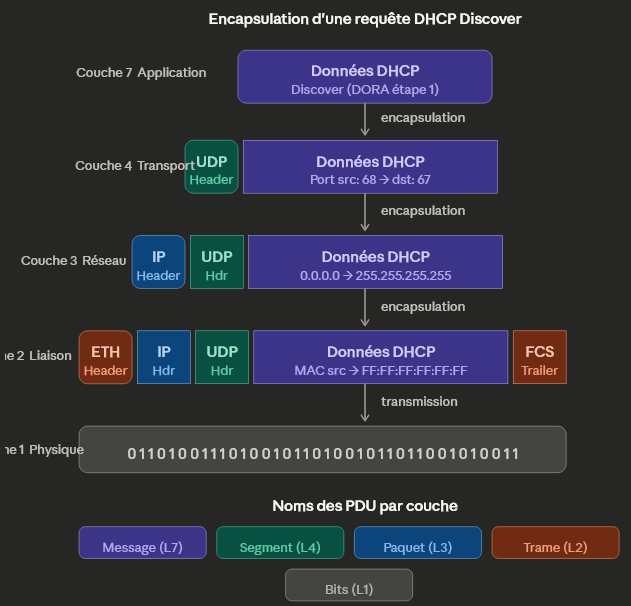

------------------------------------------------------------------------------------------------------
🎯Comprendre les bases du réseau (OSI, DHCP, NAT)
------------------------------------------------------------------------------------------------------
Cet atelier propose une exploration pratique des fondamentaux des réseaux informatiques à travers trois mécanismes essentiels : le modèle OSI, le protocole DHCP et la traduction d’adresses NAT.  
  
L’objectif est de visualiser  concrètement le fonctionnement du réseau, depuis la structure des communications jusqu’à l’attribution des adresses IP et la communication avec Internet. Dans un premier temps, nous allons découvrir le modèle OSI (Open Systems Interconnection) et son rôle comme cadre conceptuel pour organiser les communications réseau en 7 couches. Ensuite, notre atelier reviendra sur le protocole DHCP, qui permet d’attribuer automatiquement une configuration réseau (adresse IP, passerelle, DNS). Et enfin, l’atelier abordera le NAT (Network Address Translation), un mécanisme clé permettant à plusieurs machines d’un réseau privé de partager une même adresse IP publique pour accéder à Internet.  
  
**Notre atelier**  

  

-------------------------------------------------------------------------------------------------------
🧩 Séquence 1 : GitHUB
-------------------------------------------------------------------------------------------------------
Objectif : Création d'un Repository GitHUB pour travailler avec son projet  
Difficulté : Très facile (~10 minutes)
-------------------------------------------------------------------------------------------------------
**Faites un Fork de ce projet**. Si besoin, voici une vidéo d'accompagnement pour vous aider à "Forker" un Repository Github : [Forker ce projet](https://youtu.be/p33-7XQ29zQ)  

---------------------------------------------------
🧩 Séquence 2 : Création d'un site chez Pythonanywhere
---------------------------------------------------
Objectif : Créer un hébergement sur Pythonanywhere  
Difficulté : Faible (~10 minutes)
---------------------------------------------------

Rendez-vous sur **https://www.pythonanywhere.com/** et créez vous un compte. Puis créez un serveur Web **Flask 3.13**.  
  
---------------------------------------------------------------------------------------------
🧩 Séquence 3 : Les Actions GitHUB (Industrialisation Continue)
---------------------------------------------------------------------------------------------
Objectif : Automatiser la mise à jour de votre hébergement Pythonanywhere  
Difficulté : Moyenne (~15 minutes)
---------------------------------------------------------------------------------------------
Dans le Repository GitHUB que vous venez de créer précédemment lors de la séquence 1, vous avez un fichier intitulé deploy-pythonanywhere.yml et qui est déposé dans le répertoire .github/workflows. Ce fichier a pour objectif d'automatiser le déploiement de votre code sur votre site Pythonanywhere. Pour information, c'est ce que l'on appel des Actions GitHUB. Ce sont des scripts qui s'exécutent automatiquement lors de chaque Commit dans votre projet (C'est à dire à chaque modification de votre code). Ces scripts (appelés actions) sont au format yml qui est un format structuré proche de celui d'XML.  

Pour utiliser cette Action (deploy-pythonanywhere.yml), **vous avez besoin de créer des secrets dans GitHUB** afin de ne pas divulguer des informations sensibles aux internautes de passage dans votre Repository comme vos login et password par exemple.  

Pour cet atelier, **vous avez 4 secrets à créer** dans votre Repository GitHUB : **Settings → Secrets and variables → Actions → New repository secret**  
  
**PA_USERNAME** = votre username PythonAnywhere.  
**PA_TOKEN** = votre API token. Token à créer dans pythonanywhere (Acount → API Token).  
**PA_TARGET_DIR** = Web → Source code (ex: /home/monuser/myapp).  
**PA_WEBAPP_DOMAIN** = votre site (ex: monuser.pythonanywhere.com).  
  
**Dernière étape :** Pour engager l'automatisation de votre première Action, vous devez cliquer sur le gros boutton vert dans l'onglet supérieur [Actions] dans votre Repository Github. Le boutton s'intitule "I understand my workflows, go ahead and enable them"   
!
Notions acquises de cette séquence :  
Vous avez vu dans cette séquence comment créer des secrets GiHUB afin de mettre en place de l'industrialisation continue.   

---------------------------------------------------
🗺️ Séquence 4 : OSI (Open Systems Interconnection)
---------------------------------------------------
Vous pouvez observez les différentes couches OSI sur votre site **{site}.pythonanywhere.com/osi**  
  
**Exercice 1 : Définissez les termes suivants (Répondre directement dans GitHub)**    
* Un protocole — c'est un ensemble de règles et de conventions qui définissent comment deux entités communiquent à une même couche. Par exemple HTTP est un protocole de couche 7, TCP un protocole de couche 4.
Une entité protocolaire — c'est l'instance logicielle ou matérielle qui implémente un protocole à une couche donnée. Par exemple, un navigateur est une entité protocolaire de couche 7 côté client, le serveur Flask en est une autre côté serveur. Elles dialoguent entre elles via le protocole HTTP.
* Un service — c'est ce qu'une couche N offre à la couche N+1 au-dessus d'elle. Par exemple, la couche Transport (4) offre un service de communication fiable (TCP) ou non fiable (UDP) à la couche Application (7). La couche du dessus n'a pas besoin de savoir comment ça marche en dessous, elle utilise juste le service.
* Une primitive de service — c'est l'opération élémentaire par laquelle une couche interagit avec la couche adjacente. Il y en a 4 classiques : REQUEST (la couche N+1 demande quelque chose), INDICATION (la couche N signale un événement au destinataire), RESPONSE (le destinataire répond), et CONFIRM (la couche N confirme à l'émetteur). C'est un peu comme un appel de fonction entre couches.
Les 4 primitives existent parce qu'elles modélisent un dialogue complet entre deux machines via les couches. A l'instar d'un appel téléphonique :
    * **REQUEST** — l'émetteur demande à sa couche locale "envoie ça pour moi". C'est l'initiative, le point de départ. Par exemple ton navigateur demande à TCP d'envoyer une requête HTTP.
    * **INDICATION** — la couche locale côté destinataire signale "hé, j'ai reçu quelque chose pour toi". C'est la notification d'arrivée. TCP côté serveur Flask dit à l'application "un message est arrivé".
    * **RESPONSE** — le destinataire répond à sa couche locale "ok voilà ma réponse, renvoie ça". Flask donne sa réponse HTTP à TCP.
    * **CONFIRM** — la couche locale côté émetteur confirme à l'émetteur "c'est bon, ta demande a été traitée / la réponse est revenue". TCP côté navigateur confirme que la réponse est bien arrivée.

    C'est donc un cycle aller-retour complet : REQUEST → INDICATION → RESPONSE → CONFIRM. Ça correspond au pattern classique demande/
réponse. Certains services plus simples n'utilisent que REQUEST → INDICATION (sans confirmation), comme UDP qui fait du "fire and forget".
* SDU vs PDU — la SDU c'est la donnée brute reçue de la couche du dessus, la PDU c'est la SDU + l'en-tête (et éventuellement le trailer) ajoutés par la couche courante. La PDU de la couche N devient la SDU de la couche N-1.
* SAP (Service Access Point) — c'est le point d'interface entre deux couches adjacentes, là où la couche N+1 accède au service de la couche N. Concrètement, un numéro de port TCP (comme 80 ou 443) est un SAP entre la couche Transport et la couche Application : il identifie à quel service applicatif les données doivent être remises.

---------------------------------------------------
🗺️ Séquence 5 : Retour sur le protocole DHCP
---------------------------------------------------
Vous pouvez observez le protocole DHCP sur votre site **{site}.pythonanywhere.com/dhcp**  
  
**Exercice 2 : Créer une image montrant l’encapsulation des couches suivantes**    

  
--------------------------------------------------------------------
🧠 Troubleshooting :
---------------------------------------------------
Objectif : Visualiser ses logs et découvrir ses erreurs
---------------------------------------------------
Lors de vos développements, vous serez peut-être confronté à des erreurs systèmes car vous avez faits des erreurs de syntaxes dans votre code, faits de mauvaises déclarations de fonctions, appelez des modules inexistants, mal renseigner vos secrets, etc…  
Les causes d'erreurs sont quasi illimitées. **Vous devez donc vous tourner vers les logs de votre système pour comprendre d'où vient le problème** :  

Vos log sont accéssible via les URL suivantes :  
* Access log : {site}.pythonanywhere.com.access.log
* Error log : {site}.pythonanywhere.com.error.log
* Server log: {site}.pythonanywhere.com.server.log
